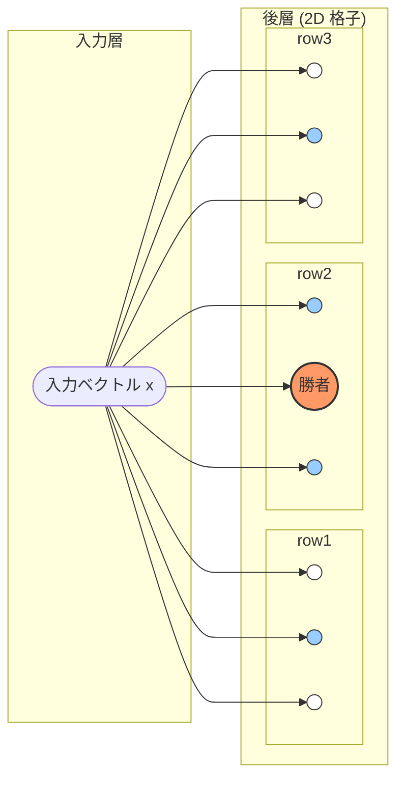

```mermaid
graph LR
  %% ノード定義
  subgraph 入力層
    x([入力ベクトル x])
  end
  subgraph "後層 (2D 格子)"
    direction TB
    subgraph row1
      N11(( )) 
      N12(( )) 
      N13(( ))
    end
    subgraph row2
      N21(( ))
      N22((勝者))
      N23(( ))
    end
    subgraph row3
      N31(( ))
      N32(( ))
      N33(( ))
    end
  end

  %% ここで矢印を定義
  x --> N11
  x --> N12
  x --> N13
  x --> N21
  x --> N22
  x --> N23
  x --> N31
  x --> N32
  x --> N33

  %% クラス定義
  classDef winner   fill:#f96, stroke:#333, stroke-width:2px;
  classDef neighbor fill:#9cf, stroke:#333;
  classDef normal   fill:#fff, stroke:#333;
  class N22 winner;
  class N12,N21,N23,N32 neighbor;
  class N11,N13,N31,N33 normal;

```
